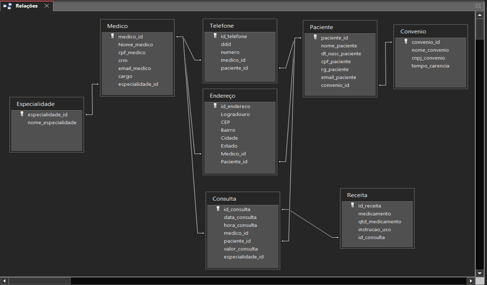
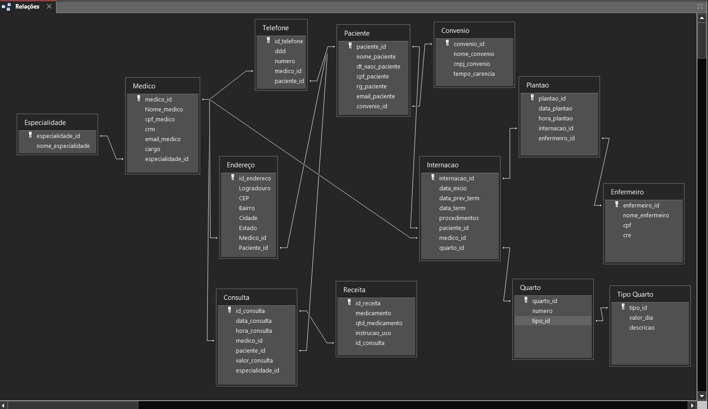

<h1> Banco de dados para um Hospital </h1>

<h2> Analise a seguinte descrição e extraia dela os requisitos para o banco de dados: </h2>

<h2> Parte 1 - Diagrama Entidade Relacionamento </h2>
<p>
Diagrama criado usando Acess
</p>
<br>

<br>
<h2> Parte 2 - Diagrama Entidade Relacionamento </h2>
<p>
Diagrama criado usando Acess
</p>
<br>

<br>
<h2> Parte 3 - Alimentando o banco de dados </h2>
<p> 

</p>
<ul>
<li> Inclua ao menos dez médicos de </li>

<li> Ao menos sete especialidades (considere a afirmação de que “entre as especialidades há pediatria, clínica geral, gastroenterologia e dermatologia”).</li>

<li> Inclua ao menos 15 pacientes. </li>

<li> Registre 20 consultas de diferentes pacientes e diferentes médicos (alguns pacientes realizam mais que uma consulta). As consultas devem ter ocorrido entre 01/01/2015 e 01/01/2022. Ao menos dez consultas devem ter receituário com dois ou mais medicamentos. </li>

<li> Inclua ao menos quatro convênios médicos, associe ao menos cinco pacientes e cinco consultas. </li>

<li> Criar entidade de relacionamento entre médico e especialidade.  </li>

<li> Criar Entidade de Relacionamento entre internação e enfermeiro.  </li>

<li> Arrumar a chave estrangeira do relacionamento entre convênio e médico. </li>

<li> Criar entidade entre internação e enfermeiro. </li>

<li> Colocar chaves estrangeira dentro da internação (Chaves Médico e Paciente). </li>

<li> Registre ao menos sete internações. Pelo menos dois pacientes devem ter se internado mais de uma vez. Ao menos três quartos devem ser cadastrados. As internações devem ter ocorrido entre 01/01/2015 e 01/01/2022. </li>

<li> Considerando que “a princípio o hospital trabalha com apartamentos, quartos duplos e enfermaria”, inclua ao menos esses três tipos com valores diferentes. </li>

<li> Inclua dados de dez profissionais de enfermaria. Associe cada internação a ao menos dois enfermeiros. </li>

<li> Os dados de tipo de quarto, convênio e especialidade são essenciais para a operação do sistema e, portanto, devem ser povoados assim que o sistema for instalado. </li>

</ul>

<br>
<h2> Parte 4 - Alterando o banco de dados </h2>
<p>

</p><br>
<div align="center">


</div>
<br>
<h2> Parte 5 - Consultas </h2>
<p> Crie um script e nele inclua consultas que retornem: </p>

1 - Todos os dados e o valor médio das consultas do ano de 2020 e das que foram feitas sob convênio.

```
select *, AVG(valor_consulta) from consulta group by year(data_consulta) = 2020 having convenio_id;
```

2 - Todos os dados e o valor médio das consultas do ano de 2020 e das que foram feitas sob convênio.

```
select * from internacao where data_efet_alta > data_prev_alta;
```

3 - Receituário completo da primeira consulta registrada com receituário associado.
```
select * from consulta inner join receita on consulta.id_consulta = receita.consulta_id inner join paciente 
on paciente.id_paciente = consulta.paciente_id order by receita.id_receita limit 1;
```

4 - Todos os dados da consulta de maior valor e também da de menor valor (ambas as consultas não foram realizadas sob convênio).

```
select *, MAX(valor_consulta), MIN(valor_consulta) from consulta group by convenio_id is null;
```

5 - Todos os dados das internações em seus respectivos quartos, calculando o total da internação a partir do valor de diária do quarto e o número de dias entre a entrada e a alta.

```
select *, DATEDIFF(data_efet_alta, data_entrada) dias_internado, tipo_quarto.valor_diario, DATEDIFF(data_efet_alta, data_entrada) * tipo_quarto.valor_diario valor_total from internacao inner join quarto on internacao.quarto_id = quarto.id_quarto inner join tipo_quarto on quarto.tipo_id = tipo_quarto.id_tipo;
```

6 - Data, procedimento e número de quarto de internações em quartos do tipo “apartamento”.

```
select i.id_internacao, i.data_entrada, i.desc_procedimentos, q.numero from internacao i inner join quarto q 
on q.id_quarto = i.quarto_id where q.tipo_id = 1; 
```

7 - Nome do paciente, data da consulta e especialidade de todas as consultas em que os pacientes eram menores de 18 anos na data da consulta e cuja especialidade não seja “pediatria”, ordenando por data de realização da consulta.

```
select p.nome_paciente, c.data_consulta, e.nome_especialidade from consulta c inner join paciente p 
on p.id_paciente = c.paciente_id inner join especialidade e 
on e.id_especialidade = c.especialidade_id 
where c.especialidade_id <> 1 and year(c.data_consulta) - year(p.dt_nasc_paciente) < 19 and year(c.data_consulta) - year(p.dt_nasc_paciente) > 0 
order by c.data_consulta ;
```

8 - Nome do paciente, nome do médico, data da internação e procedimentos das internações realizadas por médicos da especialidade “gastroenterologia”, que tenham acontecido em “enfermaria”.

```
select p.nome_paciente, m.nome_medico, i.data_entrada, i.desc_procedimentos, q.id_quarto
from internacao i
inner join medico m 
on m.id_medico = i.medico_id
inner join paciente p
on p.id_paciente = i.paciente_id
inner join quarto q
on q.id_quarto = i.quarto_id
where q.tipo_id = 3 and m.especialidade_id = 3;
```

9 - Os nomes dos médicos, seus CRMs e a quantidade de consultas que cada um realizou.

```
select m.nome_medico, m.crm, count(c.medico_id) as 'Qntd de consultas' from medico m inner join consulta c 
on c.medico_id = m.id_medico group by c.medico_id;
```

10 - Todos os médicos que tenham "Xande" no nome.

```
select * from medico where nome_medico like '%Xande%';
```

11 - Os nomes e CREs de enfermeiros que participaram de uma internação.

```
select enf.nome_enfermeiro, enf.cre as Participacao from enfermeiro enf
inner join plantao p on p.enfermeiro_id = enf.id_enfermeiro group by enf.id_enfermeiro having Participacao;
```
